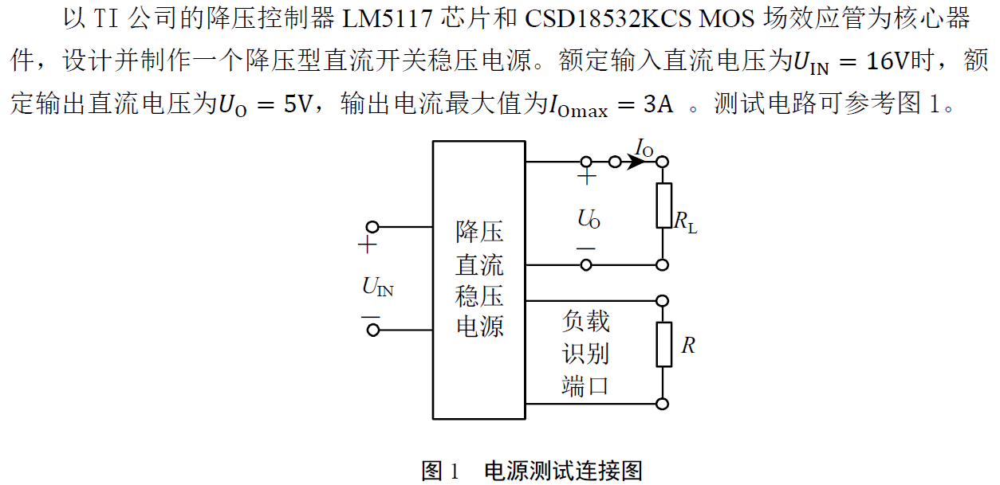
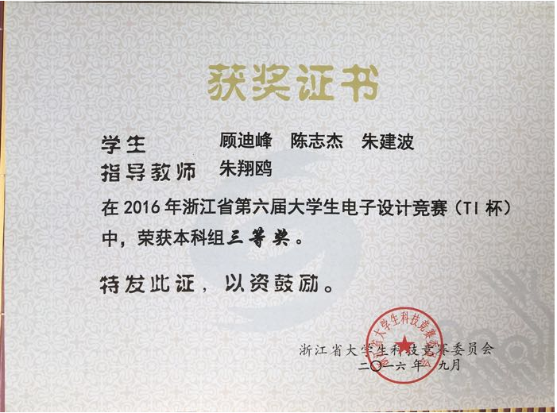
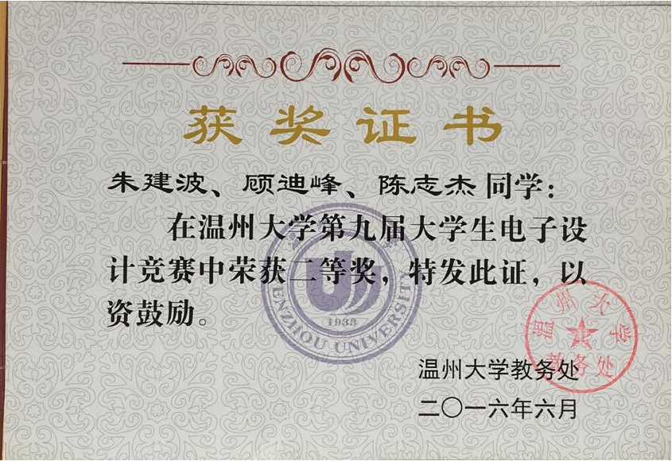

# 2016年TI杯电子设计竞赛

## A题：降压型直流开关稳压电源

### 题目介绍	[[pdf详情]](2016年TI杯大学生电子设计竞赛题A-降压型直流开关稳压电源V3.pdf)

### 我们的设计方案	[[pdf详情]](2016TI杯A题.pdf)

​		系统核心部分均采用TI的器件，包括降压控制器LM5117芯片和CSD18532KCS MOS管，设计并制作一个降压型直流开关稳压电源。系统包括Buck降压电路、稳压电路、限流电路。系统首先由以LM5117芯片为核心的Buck降压电路将输入的直流电压，输出电压通过电阻分压反馈至FB脚，自调整MOS管输出电压占空比，从而得到5V稳压。题目制定条件下，用TI提供的Tina仿真软件和Webench设计仿真均能顺利通过，焊出成品，经测试，各部分指标均可实现。此外，系统具有输出过流保护功能，并且效率可达90%以上。

### 人员分工

​		各个部分小伙伴们都有参与，以下为主要负责的部分。

|  姓名  |          分工          |
| :----: | :--------------------: |
| 陈志杰 |   硬件部分焊接和测试   |
| 顾迪锋 | 硬件部分焊接和论文撰写 |
| 朱建波 | 总体方案设计与电路测试 |

### 获奖

​		现场测试的时候发现最后输出的纹波较大（后来想想应该加个稳压二极管的），同时为了滤波加了大量CBB电容，在重量上扣分较多。最终只获得浙江省三等奖。

