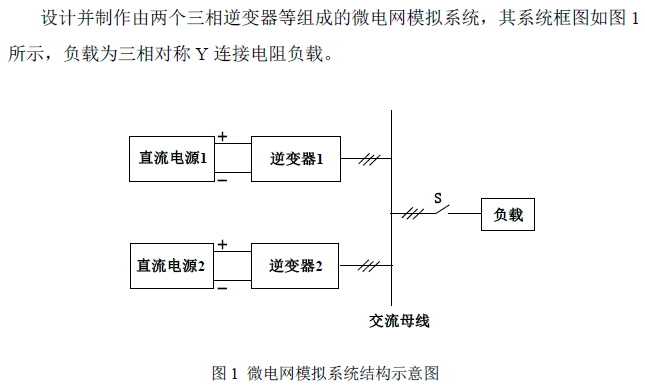
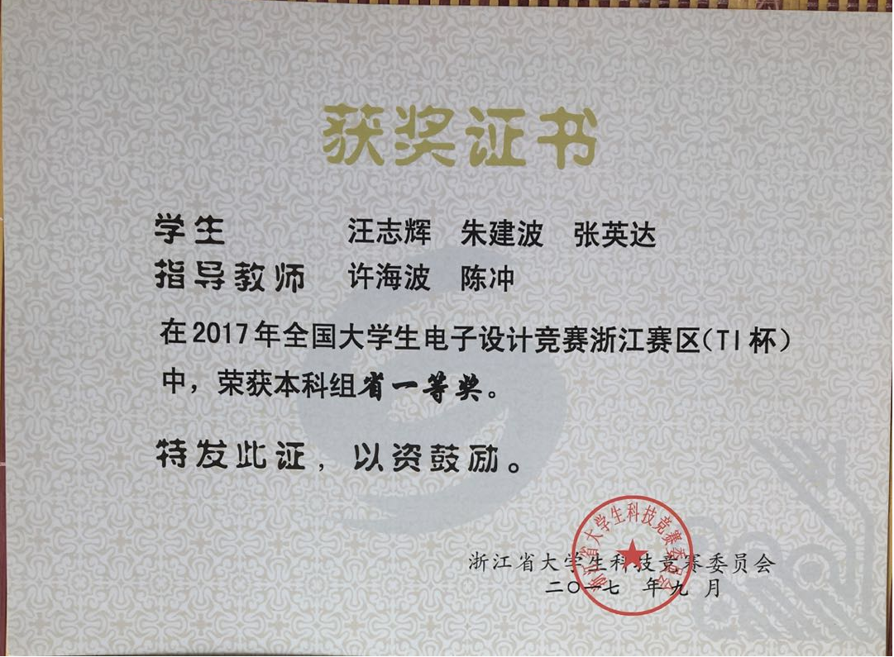

# 2017年全国大学生电子设计竞赛

## A题：微电网模拟系统

### 题目介绍	[[pdf详情]](微电网模拟系统（A题）.pdf)

### 我们的设计方案	[[pdf详情]](2017ZJA259.pdf)

​		本设计由两个独立逆变装置向负载提供能量来模拟微电网系统，逆变器拓扑结构采用三相全桥逆变电路。两台逆变器中的MOS管分别由两块独立的STM32单片机输出的SPWM波，通过L6388驱动电路来控制，其死区时间由CPLD控制。其中逆变器1作恒压源，逆变器2作恒流源，两者均采用PID反馈调节SPWM波的频率来保持电压电流的恒定。逆变器2先采集1输出的电压，获得其相位等参数，算法实现跟踪，再输出SPWM波从而保证同相输出。两台逆变器保持输出设定的功率比和减小电流差，是由两块单片机通过WIFI收发模块通讯来控制实现，体现了互联网+。此外，还具有按键、显示等功能。实验证明，本系统效率可达到92%，THD小于1%，负载调整率小于0.1%，人机交互界面友好，满足题目所有要求。

### 人员分工

​		各个部分小伙伴们都有参与，以下为主要负责的部分。

|  姓名  |          分工          |
| :----: | :--------------------: |
| 汪志辉 |    软件部分程序编写    |
| 张英达 |   硬件部分布线和焊接   |
| 朱建波 | 总体方案设计与论文撰写 |

### 获奖

​		在国赛综合测评的时候，方案计算设计好，焊接完成后发现效果并不佳，于是换方案、重新计算等等排查错误调试了很久，最后发现原来是电容规格焊错了，但是已经没什么时间再去改了。最终只获得浙江省一等奖，没有拿到国奖。

